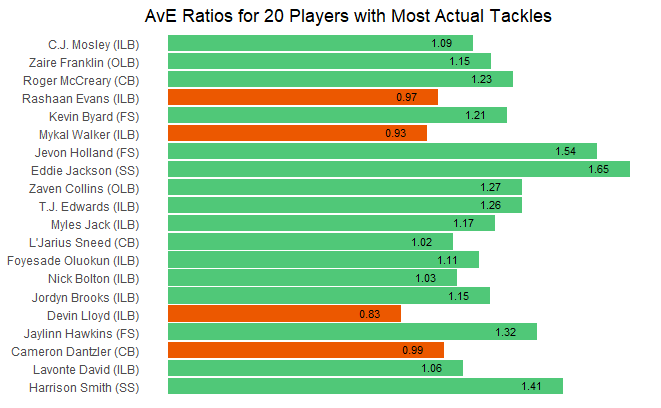

 

## Preface

How can defensive players be ranked in terms of their tackling ability? A ranking approach should consider not only how many tackles a player achieved, but also the number of tackling opportunities for that player. However, most importantly, it should account for the difficulty of the tackling opportunities.

My strategy for NFL Big Data Bowl 2024 is to follow the Metric Track and utilize the next gen stats tracking data to quantify tackling difficulty using a predictive model. For every play, I will assign a tackling probability (0-100%) to each defensive player on the field. These probabilities can be considered as proxies for the difficulty levels of each tackle.

The sum of each player's probabilities will provide an expected number of tackles for each player. The actual number of tackles made by each player compared to their expected number of tackles generated from the model will result in actual-to-expected ratios (AvE Ratio) for each player, with higher ratios being favorable and lower ratios being unfavorable.

 

$$
\text{If }E_{x} =  \text{Expected Tackles for Player } x = \sum_{{i}} p_{i,x}
\\
\text{  where } p_{i, x} \text{ is the modeled tackling probability for player } x \text{ on play } i
\\
\text{ }\\
\text{and }A_{x} =  \text{Actual Tackles for Player } x = \sum_{{i}} a_{i,x}
\\
\text{  where } a_{i, x} \text{ equals 1 if player } x \text{ made a tackle on play } i \text{ and 0 if not,}
\\
\text{ }\\
\text{then } AvE \text{ } Ratio = \frac{A_{x}}{E_{x}} \text{.}
$$

 

## Definitions and Scope

Given the vastly different factors that affect passing versus running plays, my model focuses on passing plays for this project. However, the framework could certainly be applied to running plays; the predictive variables that feed the running-plays model would likely be significantly different.

A "tackle" in context of this project is any tackle, assisted tackle, or forced fumble. The [Definitions and Scope (continued)](#definitions-and-scope-continued) section has more details.

 

## Actual Tackles by Player

Before diving into the model and feature engineering, it is worth looking at the players who have the most tackles on passing plays. Here are the top 20 players based on the data available for the first 9 weeks of the 2022 season. We'll come back to these players at the end to see if their high tackle numbers are above or below expectations.

 

## Feature Engineering and Model Inputs

This model will focus on assigning tackling probabilities based on information available *at the time of the catch*. Below are the predictive variables used by the model. Each field is calculated specifically for each defender of each play. The [Feature Engineering (continued)](#feature-engineering-continued) section contains more details about variable derivation and includes visuals that show the univariate relationship between each variable and tackle results.

1.  **The defender's distance from the receiver at the time of the catch.**

2.  **Defender's Distance Rank**: This variable utilizes the distance of the defender from the receiver at the time of the catch (from above), but it ranks the defenders from closest to furthest. Rank/level "1" is the closest defender to the receiver, "2" is second closest, "3" is 3rd closest, and finally level "4+" is any defender ranked 4 or higher.

3.  **Is the defender in front of or behind the receiver?** In "front" means the defender is between the receiver and the receiver's target endzone. Given that a tackle has been made, there is over an 85% chance that the defender was in front of the receiver when the catch was made.

4.  **The directional velocity of the defender.** This variable accounts for both the speed of the defender and the direction of movement of the defender relative to the position of the receiver. A large positive directional velocity means the defender is moving quickly towards the receiver, whereas a large negative directional velocity means the defender is moving quickly away from the receiver.

5.  **Whether there are 0 impactful blockers for that defender or 1 or more impactful blockers for that defender.** An impactful blocker is defined when 2 conditions are met. (1) The blocker is closer to the receiver than the defender at the time of catch. (2) The blocker's x coordinate must be between the x coordinates of the defender and the receiver. This second condition eliminates blockers who are on the opposite side of the receiver as the defender. These 2 conditions essentially mean that an impactful blocker is a blocker that is between the defender and the receiver.

6.  **Receiver's distance from the nearest sideline.** The nearest sideline is the sideline to which the receiver is closest. This is the one independent variable in the model that is *not* unique for each defender; each defender in the play has the same value for this field.

I considered and tested other variables and other manipulations of the metrics above, but they either added no lift to the model or added too little lift to justify the risk of over-fitting the model and making the model more complicated. Also, some variables that I had hoped to use, particularly orientation direction, were inaccurately recorded in the tracking data, so I opted to exclude those as well.

 

## Building the Logistic Regression Model

I selected a logistic regression model (LRM) for this project, as it is an excellent and popular candidate for predicting probabilities.

I considered other models such as a Classification and Regression Tree (CART), but I preferred the continuous outcomes available in a LRM. I ran a CART model for exploration purposes, and the CART model found the ranked defender distance levels explained above to be the most explanatory variable.

The training and testing of the LRM is described in the [Splitting Data into Training and Testing Sets] section of the Appendix.

Below are the independent variables and their impact on the predicted tackling probability. The [Model Details] section contains the full summary and coefficents of the LRM.

-   As the defender gets further away from the receiver, their tackle probability goes down.

-   Similarly, as the defender's distance rank goes up, their tackle probability goes down significantly.

-   The defender's tackling probability increases significantly if they are in front of the receiver.

-   As the defender's directional velocity increases, their tackling probability increases.

-   If there are no impactful blockers in the defender's area, the defender's tackling probability goes up.

-   Tackling probability is higher when the receiver is close to the sidelines.

 

## Fine-Tuning Modeled Probabilities

Modeled probabilities were fine-tuned to ensure no plays had a total probability below 100% across all 11 defenders. Probabilities were also fine-tuned to allocate very small probabilities (often assigned to linesmen far removed from the play) to relevant defenders. More details are described in the [Fine-Tuning Probabilities (continued)](#fine-tuning-probabilities-continued) section of the Appendix.

The below chart shows all of the records in our data that have modeled probabilities of at least 5%. Each bar represents one defender on one play. Higher probabilities are on the left and lower probabilities are on the right. Instances where the defender achieved the tackle are marked in green.

 

## Example Play

The model is best understood with an example. There is a [clip of the play](https://youtu.be/ntW7FJuXtJA?t=390 "link to clip on YouTube") available on YouTube (if the link doesn't take you right to the play, you can jump to time stamp 6:30 in the video). J. Brissett passes the ball to A. Cooper for a 32-yard gain. C. Sutton (jersey number 20) makes the tackle. Below are the probabilities the model assigned to each defender on the play.

Sutton - who ultimately made the tackle - is assigned the highest probability (88.6%). He is only 3 yards from the receiver, he is the closest defender to the receiver, he is in front of the receiver, he has a positive directional velocity (i.e., he is moving towards the receiver's position) of reasonable magnitude, and there are no impactful blockers in his area.

Minkah Fitzpatrick (jersey number 39) is also very close to the receiver. However, his probability of 11.4% is significantly lower than Sutton's due to him being 5 yards further away, him being the second closest defender, and him being behind the receiver.

 

## Results

The plot below shows the total actual tackles versus the total expected tackles for the 192 players who had at least 15 expected tackles modeled. 99 players performed below expectations and 93 performed above expectations; this even split indicates that the model is not overly punitive or overly generous. The black line shows the actual = expected line.

 

Let's look back at the 20 players who had the most actual passing tackles. The chart below shows the same 20 players in the same order as before (most tackles at the top). However, instead of their actual tackles being shown, we now show their AvE Ratios. 16 of the 20 players performed better than expected, some more than others. 4 of the players performed worse than expected. This demonstrates why it's important not to look solely at number of tackles when evaluating a player's tackling ability.

 

Who are the best and worst passing tacklers according to the model? The chart below shows the best 10 and worst 10 AvE Ratios of those who had at least 15 expected tackles modeled.

 

Let's look at the plays of Eddie Jackson - the best performer. Each point on the plot below represents a play for Eddie Jackson. He was often successful at getting the tackle when the model indicated a high likelihood of him getting the tackle. Of the 14 plays where his modeled probability was over 50%, he achieved a tackle 11 times - a 79% success rate.

Additionally, he was able to achieve tackles on several occasions when the model indicated it to be unlikely. Eddie had 138 plays where his modeled tackle probability was below 50%. He achieved a tackle on 24 of these plays - a 17% success rate.

[Here is a clip](https://youtu.be/jke1evV-b2w?t=195) of a play where Eddie Jackson (#4 on the Bears) was unlikely to make the tackle according to the model, yet he achieved the tackle.

 

Now, let's look at the plays of the worst performer - Eli Apple. Eli missed several high-probability tackles. Of the 20 plays where his modeled probability was over 50%, he achieved a tackle 13 times - a 65% success rate on likely tackles compared to Eddie Jackson's 79% success rate on likely tackles.

He also achieved almost zero unlikely tackles; he only made one tackle out of the 109 plays that had modeled probabilities below 50% - a 1% success rate on unlikely tackles compared to Eddie Jackson's 17% success rate on unlikely tackles.

 

## Conclusion & Applications

I have demonstrated how this model can be used to evaluate players' passing tackle abilities compared to expectations based on the difficulty of their tackling opportunities. I used the model's results to evaluate individual players. However, applications of this model and its framework reach beyond this single analysis:

-   A similar model could be built for running plays. Different feature engineering and input variables would be required due to the vast differences between running and passing plays.

-   Predicted outcomes could be used in more ways than just evaluating defensive player performance. For example, one could use predicted outcomes to evaluate how good receivers are at avoiding highly likely tackles.

-   In addition to summing actual and expected values across all plays to arrive at an AvE Ratio (as I did), one could focus only on high-probability plays. This would effectively determine who executes tackles when it is expected of them. Alternatively, focusing only on low-probability plays would determine who is able to achieve unexpected tackles.

-   Results of this model could be incorporated into another model by using a player's modeled tackling ability as an independent input.

 

 

------------------------------------------------------------------------

# Appendix

### Definitions and Scope (continued) {#definitions-and-scope-continued}

Tackles, assists, and forced fumbles are treated equally in value. I was hoping to include missed tackles as "successes" in my predictive model because they should result in tackles (though, I would not include them in the actual tackles calculation in the numerator of the AvE Ratio), but it was not possible to distinguish, say, a lineman missing a QB sack from a cornerback missing a tackle of the receiver, as the tracking data did not include an indicator for missed tackle in the event field. I did not want a lineman missing a sack to inappropriately influence my model focused on tackles after a receiver catches the ball.

(go back to main [Definitions and Scope] section)

 

### Feature Engineering (continued) {#feature-engineering-continued}

Below are the independent variables used by the model along with plots showing their univariate relationship to tackle results. More details surrounding each variable's calculation are provided when necessary.

1.  **Defender's distance from receiver.**

    

     

2.  **Defender's distance from receiver rank**: Ranks 4 through 11 had similar relationships to tackle results, so I opted to combine these ranks together to avoid over-complicating the model. There was enough distinction between ranks 1, 2, and 3 to justify keeping these as separate factor levels.

    

     

3.  **Is the defender in front of or behind the receiver?**

    

     

4.  **Directional Velocity**: For directional velocity, the positive or negative sign is determined by applying the cosine function to their angle of direction relative to the receiver's location. The relative angle is derived with the arc tangent function based on the (x,y) coordinates of both players and the angle the defender is moving. Exact formulas can be found in the **geometry_functions.R** script in the GitHub repository linked above. If the defender is moving at a speed 2 but in the exact opposite direction of the receiver's position, their directional velocity is -2. On the contrary, if the defender is moving at speed 2 and in the direction of the receiver's position exactly, their directional velocity is 2 (positive). Any angle below 90 degrees from the receiver will result in a positive directional velocity, whereas any angle above 90 degrees (below 180) will result in a negative directional velocity.

    

    The plot below shows the relationship between directional velocity and the defender's angle of movement relative to the position of the receiver.

    

     

5.  **Impactful Blockers**: All 10 blockers (11 offensive players on the field minus the receiver) are assigned as impactful or not for each defender separately. The number of impactful blockers is then summed for each defender, so each defender has between 0 and 10 impactful blockers. The model uses None or 1+ impactful blockers to avoid over-fitting and complication, as there was little distinction between 1 through 10 impactful blockers.

    

     

6.  **Receiver's distance from the nearest sideline**. The univariate relationship between the receiver's distance from the sideline and whether or not a tackle occurred is not revealing in of itself. However, this metric provides lift in the model when used in conjunction with the other independent variables.

    

     

(go back to main [Feature Engineering and Model Inputs] section)

 

### Splitting Data into Training and Testing Sets

70% of the data was randomly assigned as the training set and the remaining 30% as the testing set. Any given play was completely contained in either set, as I did not want some defenders of a play to be in the training set and other defenders of the same play to be in the testing set. The training data has about 41K rows (11 defenders for each of 3,720 plays), and the testing data has about 17.5K rows (11 defenders for each of 1,594 plays), where each row represents each defender on each of the 5,314 passing plays that meet our criteria.

The model was re-trained on all data (training plus test sets) once the independent variables were finalized.

(go back to main [Building the Logistic Regression Model] section)

 

### Model Details

It is important to note that the predicted probabilities of the logistic regression model are often then converted into 1's or 0's based on a selected threshold (e.g., 50% or more goes to 1 and less than 50% goes to 0); however, I did *not* convert my predicted probabilities to 1's and 0's, as I wanted to keep the raw probabilities for our actual-to-expected ratio calculation defined above.

The full model summary is below.

(go back to main [Building the Logistic Regression Model] section)

 

### Fine-Tuning Probabilities (continued) {#fine-tuning-probabilities-continued}

The model understandably assigned extremely low probabilities in some cases, particularly for linesmen who were far removed from the reception area. This sometimes meant that the total probability across all 11 defenders for a given play summed to below 100%. Probabilities for any sub-100% plays were normalized so that their relativities by player were still the same but that the total probability for the play summed to 100%. As my focus is mainly for defenders involved after the catch, I also allocated very low probabilities (below 5%) to the higher-probability players involved in those plays. In other words, the small probabilities often assigned to the linesmen were allocated to the defenders more likely to make the tackle. The resulting relativities among the higher-probability players remained unchanged from before this allocation step.

(go back to main [Fine-Tuning Modeled Probabilities] section)

 
